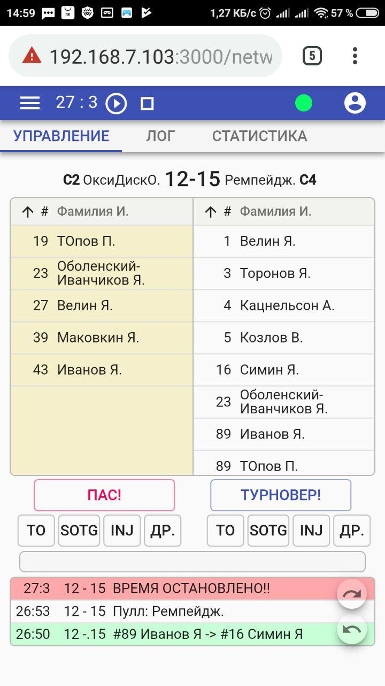

# Статистика игр по <a href="https://ru.wikipedia.org/wiki/%D0%90%D0%BB%D1%82%D0%B8%D0%BC%D0%B0%D1%82_%D1%84%D1%80%D0%B8%D1%81%D0%B1%D0%B8">алтимат фрисби</a>

Программа для сбора статистики матчей по флаинг диску (алтимат фрисби). Предполагается для использования обслуживающим
персоналом (судей или стаффа) игр на официальных соревнованиях федерации флаинг диска России (ФФДР). Разработана по заказу федерации спортивных игр с летающим диском Новгородской области.

Текущая стадия - бета-тестирование.

<p align="center">
  
</p>

Собираются следующие данные: <br>

* итоговый счет
* гол + пас согласно командным спискам
* все остановки в игре
* переходы владений диска
* остановки таймера игры
* все пасы команд


Статистика собирается с учетом времени игры - есть игровой таймер с основными функциями управления

## Пример работы

Превью программы представлено по адресу <a href="http://www.novak.su/test/stats">www.novak.su/test/stats</a> <br>

## Установка

Для локальной работы работы, сделайте форк и клонируйте репозиторий. Затем установите зависимости

```sh
$ npm install
```

затем выполните команду:

```sh
$ npm run start
```


Необходимо наличие установленного пакетного менеджера NPM.

## Особенности программы:

* собирает статистику с учетом времени игры
* возможность управлять игрой на одном экране, который содержит все необходимые кнопки управления
* удобная работа с игровым логом - имеется отдельное окно с логом игры и превью лога на основном экране сбора статистики
* возможность откатвать действия оператора программы (UNDO и REDO)
* адаптивная верстка, в том числе по вертикали, для работы на любых современных мобильных устройствах
* возможность выгрузки файла со статистикой по окончании игры
* хранение всей собранной статистики на устройстве оператора (в localstorage)
* возможность продолжения работы с рпограммой при обрыве связи с сервером (синхронизация по возобновлении подключения)


