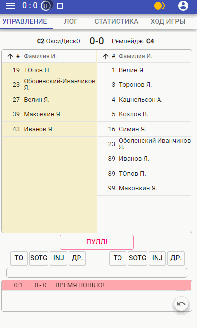

# The application for collecting statistics of <a href="https://en.wikipedia.org/wiki/Ultimate_(sport)">Ultimate Frisbee</a> sport matches.

Purpose of the program is collect statistic for ultimate frisbee matches in tournaments. Judges and games scorekeepers (staff) can use it in official ultimate frisbee tournaments according with Russia flying disc federation.
Customer - Novgorod flying disc federation.

Russian readme in <a href="README-ru.md">README-ru.md</a> file. <br>
 
<p>
  
</p>
Look at the user manual in <a href="ultimate_stats_docs_ru.pdf">ultimate_stats_docs_ru.pdf</a> (rus). <br><br>

Collects the following data: <br>

* final score of the game
* goals and assists, according with teams rosters
* collect all stoppage of the game
* turnovers
* collect all operators actions including time stoppage
* all disk throws

Program has a timer and all actions in the game have time stamps.

## Installation

For local working, make fork and clone the repo. Install dependencies:

```sh
$ npm install
```

then execute

```sh
$ npm run serve
```

## App features:

* collect statistics with time stamps
* all control buttons is in one screen
* convenient workflow with a game log, there are two modes - preview mode and full mode
* UNDO и REDO for logs
* adaptive markup (includes height adaptive) for convenient work in all modern mobile devices
* downloading a game file to device
* all game statistics hold on the operator's device (in localstorage)
* working with network breaks (sync after communication restoration)
