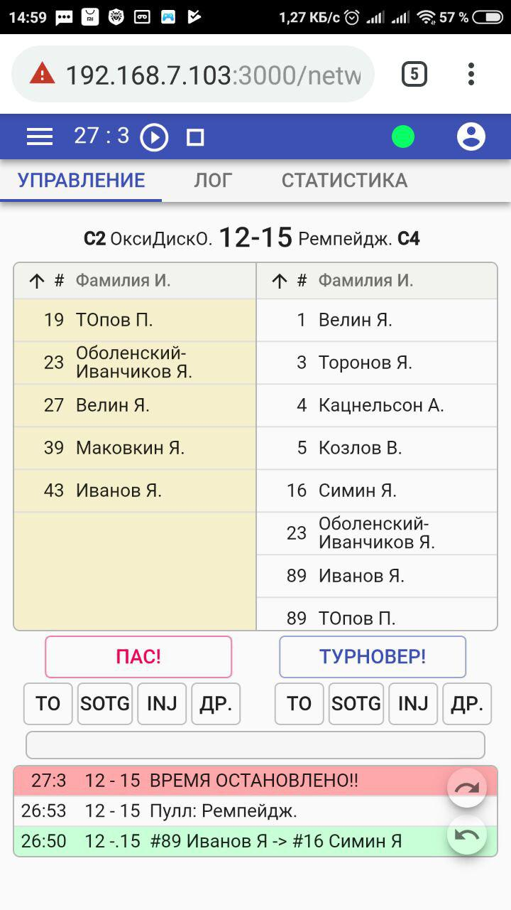

# Сборщик статистики для <a href="https://ru.wikipedia.org/wiki/%D0%90%D0%BB%D1%82%D0%B8%D0%BC%D0%B0%D1%82_%D1%84%D1%80%D0%B8%D1%81%D0%B1%D0%B8">алтимат фрисби</a>

Программа для сбора статистики матчей по флаинг диску (алтимату). Предполагается для использования обслуживающим
персоналом (судей или стаффа) игр на официальных соревнованиях федерации флаинг диска России (ФФДР). Разработана по заказу федерации спортивных игр с летающим диском Новгородской области.
Программа находится на стадии бета-тестирования.

<p align="center">
  
</p>

С помощью данной программы организаторы соревнований смогут собрать следующую статистику по каждому матчу: <br>

* итоговый счет
* гол + пас согласно командным спискам
* все остановки в игре
* переходы владений диска
* остановки таймера игры
* все пасы команд


Вся статистика собирается с учетом времени игры - реализован игровой таймер с основными функциями управления

## Пример работы

Превью программы представлено по адресу <a href="http://www.novak.su/test/stats">www.novak.su/test/stats</a> <br>

## Установка

Для локальной работы работы, сделайте форк данного репозитория. Затем установите зависимости

```sh
$ nmp install
```
Необходимо наличие установленного пакетного менеджера NPM.

## Основные преимущества данного продукта:

* вся статистика собирается с учетом времени игры
* управление игрой - на одном экране, который содержит все необходимые кнопки управления
* удобная работа с игровым логом - имеется отдельное окно с логом игры и превью лога на основном экране сбора статистики
* возможность отката действия оператора программы (UNDO и REDO)
* адаптивная верстка, в том числе по вертикали, для работы на любых современных мобильных устройствах
* возможность выгрузки файла со статистикой по окончании игры
* хранение всей собранной статистики на устройстве оператора (в localstorage) на случай потерия связи с сервером

